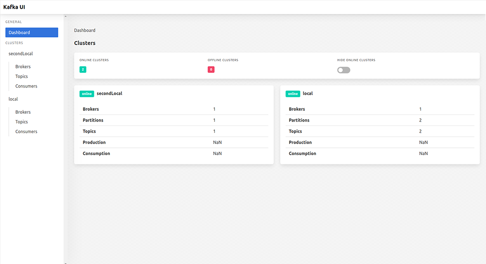

 Kafka UI – Free Web UI for Kafka &nbsp; 
------------------


<em>Kafka UI is a free open-source web UI for monitoring and management of Apache Kafka clusters. </em> 

Kafka UI is a simple tool that makes your data flows observable, helps find and troubleshoot issues faster and deliver optimal performance. Its lightweight dashboard makes it easy to track key metrics of your Kafka clusters - Brokers, Topics, Partitions, Production, and Consumption. 

Set up Kafka UI with just a couple of easy commands to visualize your Kafka data in a comprehensible way. You can run the tool locally or in the cloud. 




# Features
* **Multi-Cluster Management** — monitor and manage all your clusters in one place
* **Performance Monitoring with Metrics Dashboard** —  track key Kafka metrics with a lightweight dashboard
* **View Kafka Brokers** — view topic and partition assignments, controller status
* **View Kafka Topics** — view partition count, replication status, and custom configuration
* **View Consumer Groups** — view per-partition parked offsets, combined and per-partition lag
* **Browse Messages** — browse messages with JSON, plain text and Avro encoding
* **Dynamic Topic Configuration** — create and configure new topics with dynamic configuration
* **Configurable Authentification** — secure your installation with optional Github/Gitlab/Google OAuth 2.0
 

# Getting Started

To run Kafka UI, you can use a pre-built Docker image or build it locally.  

## Running From Docker Image
The official Docker image for Kafka UI is hosted here: [hub.docker.com/r/provectuslabs/kafka-ui](https://hub.docker.com/r/provectuslabs/kafka-ui).

Launch Docker container in the background:
```sh

docker run -p 8080:8080 \
	-e KAFKA_CLUSTERS_0_NAME=local \
	-e KAFKA_CLUSTERS_0_BOOTSTRAPSERVERS=kafka:9092 \
	-d provectuslabs/kafka-ui:latest 

```
Then access the web UI at [http://localhost:8080](http://localhost:8080).  
Further configuration with environment variables - [see environment variables](#env_variables)  
 
### Docker Compose

If you prefer to use `docker-compose` please refer to the [documentation](docker-compose.md).


## Building With Docker

Steps to build Kafka UI locally with Docker:  

1. Install prerequisites: Java and Docker
2. Clone this repository and open a terminal in the directory of the project
3. Build a Docker container with Kafka UI
4. Start Kafka UI with your Kafka clusters
5. Navigate to Kafka UI 

### Prerequisites

* Java 13 or newer
* Docker 

### Installing Prerequisites on Mac
1. Install Homebrew Cask:
```sh
> brew update
``` 
2. Install JAVA 13 with Homebrew Cask:
```sh
> brew tap adoptopenjdk/openjdk
> brew install adoptopenjdk13
``` 
### Building

Once you installed the prerequisites and cloned the repository, run the following commands in your project directory: 

Build a Docker container with Kafka UI: 
```sh
./mvnw clean install -Pprod
``` 
Start Kafka UI with your Kafka clusters: 
```sh
docker-compose -f ./docker/kafka-ui.yaml up
``` 
To see Kafka UI, navigate to http://localhost:8080.

If you want to start only kafka-clusters: 
```sh
docker-compose -f ./docker/kafka-clusters-only.yaml up
``` 
Then start Kafka UI with a **local** profile. 

## Running Locally Without Docker

```sh
./mvnw spring-boot:run -Pprod
``` 


## Running in Kubernetes
``` bash
helm repo add kafka-ui https://provectus.github.io/kafka-ui
helm install kafka-ui kafka-ui/kafka-ui
```
To read more please follow to [chart documentation](charts/kafka-ui/README.md)

# Guides

To be done

## Connecting to a Secure Broker

Kafka UI supports TLS (SSL) and SASL connections for [encryption and authentication](http://kafka.apache.org/090/documentation.html#security). This can be configured by providing a combination of the following files (placed into the Kafka root directory):

To be continued


# Configuration

## Configuration File
Example of how to configure clusters in the [application-local.yml](https://github.com/provectus/kafka-ui/blob/master/kafka-ui-api/src/main/resources/application-local.yml) configuration file:


```sh
kafka:
  clusters:
    -
      name: local
      bootstrapServers: localhost:29091
      zookeeper: localhost:2183
      schemaRegistry: http://localhost:8085
#     schemaNameTemplate: "%s-value"
      jmxPort: 9997
    -
```    

* `name`: cluster name
* `bootstrapServers`: where to connect
* `zookeeper`: zookeeper service address
* `schemaRegistry`: schemaRegistry's address
* `schemaNameTemplate`: how keys are saved to schemaRegistry
* `jmxPort`: open jmxPosrts of a broker
* `readOnly`: enable read only mode

Configure as many clusters as you need by adding their configs below separated with `-`.

## <a name="env_variables"></a> Environment Variables

Alternatively, each variable of of the .yml file can be set with an environment variable. 
For example, if you want to use an environment variable to set the `name` parameter, you can write it like this: `KAFKA_CLUSTERS_2_NAME`

|Name               	|Description
|-----------------------|-------------------------------
|`KAFKA_CLUSTERS_0_NAME` | Cluster name
|`KAFKA_CLUSTERS_0_BOOTSTRAPSERVERS` 	|Address where to connect 
|`KAFKA_CLUSTERS_0_ZOOKEEPER` 	| Zookeper service address 
|`KAFKA_CLUSTERS_0_KSQLDBSERVER` 	| KSQL DB server address 
|`KAFKA_CLUSTERS_0_PROPERTIES_SECURITY_PROTOCOL` 	|Security protocol to connect to the brokers. For SSL connection use "SSL", for plaintext connection don't set this environment variable
|`KAFKA_CLUSTERS_0_SCHEMAREGISTRY`   	|SchemaRegistry's address
|`KAFKA_CLUSTERS_0_SCHEMANAMETEMPLATE`  |How keys are saved to schemaRegistry
|`KAFKA_CLUSTERS_0_JMXPORT`        	|Open jmxPosrts of a broker
|`KAFKA_CLUSTERS_0_READONLY`        	|Enable read only mode. Default: false
|`LOGGING_LEVEL_ROOT`        	| Setting log level (all, debug, info, warn, error, fatal, off). Default: debug
|`LOGGING_LEVEL_COM_PROVECTUS`        	|Setting log level (all, debug, info, warn, error, fatal, off). Default: debug

 

 

