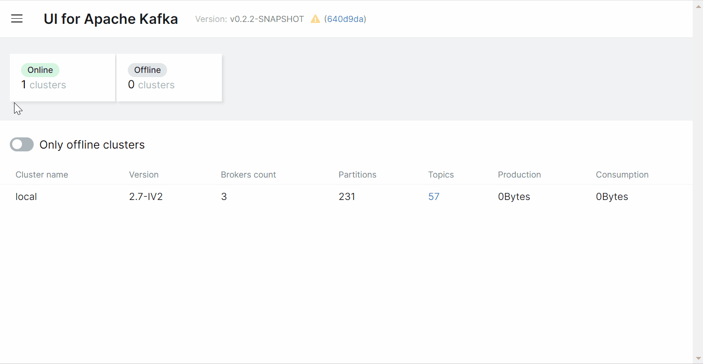
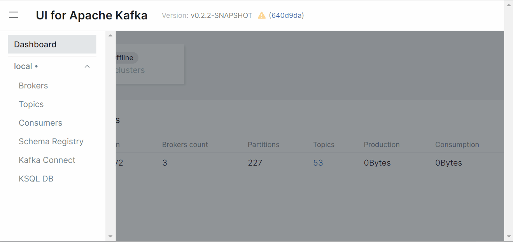
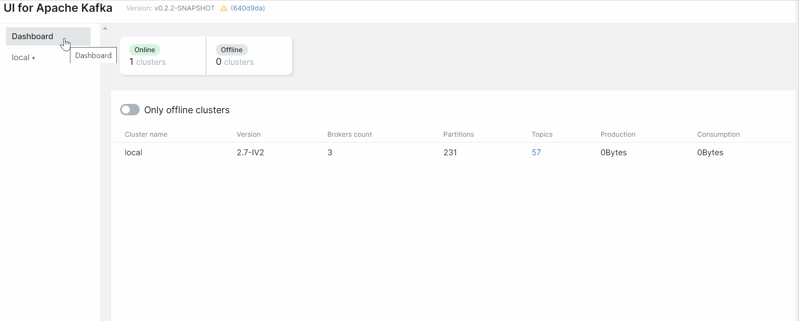
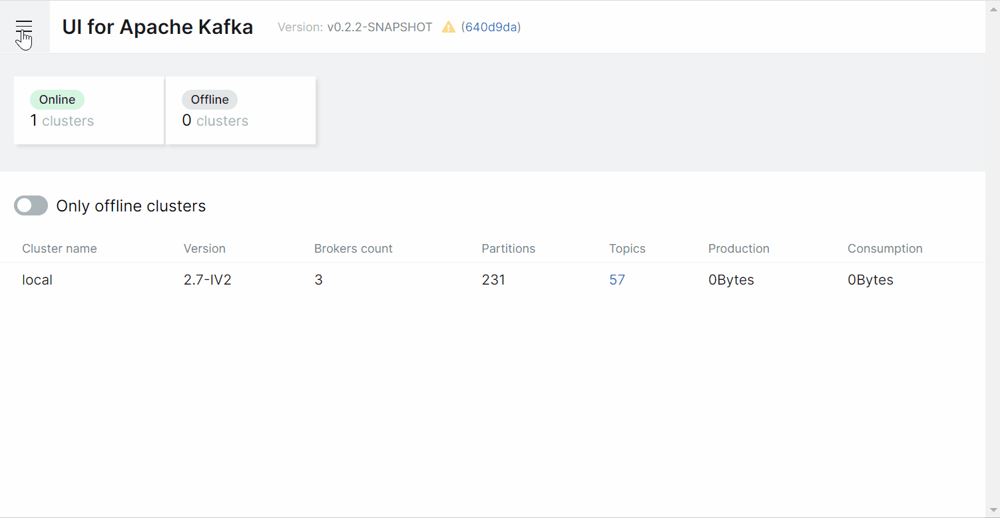
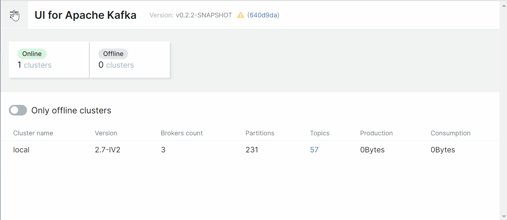

 UI for Apache Kafka&nbsp;
------------------
#### Versatile, fast and lightweight web UI for managing Apache Kafka® clusters. Built by developers, for developers.

[](https://github.com/provectus/kafka-ui/blob/master/LICENSE)

[](https://github.com/provectus/kafka-ui/releases)
[](https://discord.gg/4DWzD7pGE5)

<em>UI for Apache Kafka is a free, open-source web UI to monitor and manage Apache Kafka clusters. </em> 

UI for Apache Kafka is a simple tool that makes your data flows observable, helps find and troubleshoot issues faster and deliver optimal performance. Its lightweight dashboard makes it easy to track key metrics of your Kafka clusters - Brokers, Topics, Partitions, Production, and Consumption. 

Set up UI for Apache Kafka with just a couple of easy commands to visualize your Kafka data in a comprehensible way. You can run the tool locally or in 
the cloud. 



# Features
* **Multi-Cluster Management** — monitor and manage all your clusters in one place
* **Performance Monitoring with Metrics Dashboard** —  track key Kafka metrics with a lightweight dashboard
* **View Kafka Brokers** — view topic and partition assignments, controller status
* **View Kafka Topics** — view partition count, replication status, and custom configuration
* **View Consumer Groups** — view per-partition parked offsets, combined and per-partition lag
* **Browse Messages** — browse messages with JSON, plain text, and Avro encoding
* **Dynamic Topic Configuration** — create and configure new topics with dynamic configuration
* **Configurable Authentification** — secure your installation with optional Github/Gitlab/Google OAuth 2.0
 
# The Interface
UI for Apache Kafka wraps major functions of Apache Kafka with an intuitive user interface.


## Topics
UI for Apache Kafka makes it easy for you to create topics in your browser by several clicks, 
pasting your own parameters, and viewing topics in the list.



It's possible to jump from connectors view to corresponding topics and from a topic to consumers (back and forth) for more convenient navigation.
connectors, overview topic settings. 



### Messages
Let's say we want to produce messages for our topic. With the UI for Apache Kafka we can send or write data/messages to the Kafka topics without effort by specifying parameters, and viewing messages in the list.


## Schema registry
There are 3 supported types of schemas: Avro®, JSON Schema, and Protobuf schemas.



Before producing avro-encoded messages, you have to add an avro schema for the topic in Schema Registry. Now all these steps are easy to do 
with a few clicks in a user-friendly interface.



# Getting Started

To run UI for Apache Kafka, you can use a pre-built Docker image or build it locally.  

## Configuration

We have plenty of [docker-compose files](documentation/compose/DOCKER_COMPOSE.md) as examples. They're built for various configuration stacks.

### Configuration File
Example of how to configure clusters in the [application-local.yml](https://github.com/provectus/kafka-ui/blob/master/kafka-ui-api/src/main/resources/application-local.yml) configuration file:


```sh
kafka:
  clusters:
    -
      name: local
      bootstrapServers: localhost:29091
      zookeeper: localhost:2183
      schemaRegistry: http://localhost:8085
      schemaRegistryAuth:
        username: username
        password: password
#     schemaNameTemplate: "%s-value"
      jmxPort: 9997
    -
```    

* `name`: cluster name
* `bootstrapServers`: where to connect
* `zookeeper`: zookeeper service address
* `schemaRegistry`: schemaRegistry's address
* `schemaRegistryAuth.username`: schemaRegistry's basic authentication username
* `schemaRegistryAuth.password`: schemaRegistry's basic authentication password
* `schemaNameTemplate`: how keys are saved to schemaRegistry
* `jmxPort`: open jmxPosrts of a broker
* `readOnly`: enable read only mode

Configure as many clusters as you need by adding their configs below separated with `-`.

## Running From Docker Image
The official Docker image for UI for Apache Kafka is hosted here: [hub.docker.com/r/provectuslabs/kafka-ui](https://hub.docker.com/r/provectuslabs/kafka-ui).

Launch Docker container in the background:
```sh

docker run -p 8080:8080 \
	-e KAFKA_CLUSTERS_0_NAME=local \
	-e KAFKA_CLUSTERS_0_BOOTSTRAPSERVERS=kafka:9092 \
	-d provectuslabs/kafka-ui:latest 

```
Then access the web UI at [http://localhost:8080](http://localhost:8080).  
Further configuration with environment variables - [see environment variables](#env_variables)  
 
### Docker Compose

If you prefer to use `docker-compose` please refer to the [documentation](docker-compose.md).


## Building With Docker

### Prerequisites

Check [software-required.md](documentation/project/contributing/software-required.md)

### Building

Check [building.md](documentation/project/contributing/building.md)

### Running

Check [running.md](documentation/project/contributing/running.md)

# Guides

- [SSO configuration](documentation/guides/SSO.md)
- [AWS IAM configuration](documentation/guides/AWS_IAM.md)
- [Docker-compose files](documentation/guides/yaml-description.md)

## Connecting to a Secure Broker

UI for Apache Kafka supports TLS (SSL) and SASL connections for [encryption and authentication](http://kafka.apache.org/090/documentation.html#security). This can be configured by providing a combination of the following files (placed into the Kafka root directory):

To be continued

## Liveliness and readiness probes
Liveliness and readiness endpoint is at `/actuator/health`.
Info endpoint (build info) is located at `/actuator/info`.

## <a name="env_variables"></a> Environment Variables

Alternatively, each variable of the .yml file can be set with an environment variable. 
For example, if you want to use an environment variable to set the `name` parameter, you can write it like this: `KAFKA_CLUSTERS_2_NAME`

|Name               	|Description
|-----------------------|-------------------------------
|`SERVER_SERVLET_CONTEXT_PATH`  | URI basePath
|`LOGGING_LEVEL_ROOT`        	| Setting log level (trace, debug, info, warn, error). Default: info
|`LOGGING_LEVEL_COM_PROVECTUS`  |Setting log level (trace, debug, info, warn, error). Default: debug
|`SERVER_PORT` |Port for the embedded server. Default: `8080`
|`KAFKA_ADMIN-CLIENT-TIMEOUT` | Kafka API timeout in ms. Default: `30000`
|`KAFKA_CLUSTERS_0_NAME` | Cluster name
|`KAFKA_CLUSTERS_0_BOOTSTRAPSERVERS` 	|Address where to connect 
|`KAFKA_CLUSTERS_0_ZOOKEEPER` 	| Zookeeper service address 
|`KAFKA_CLUSTERS_0_KSQLDBSERVER` 	| KSQL DB server address 
|`KAFKA_CLUSTERS_0_PROPERTIES_SECURITY_PROTOCOL` 	|Security protocol to connect to the brokers. For SSL connection use "SSL", for plaintext connection don't set this environment variable
|`KAFKA_CLUSTERS_0_SCHEMAREGISTRY`   	|SchemaRegistry's address
|`KAFKA_CLUSTERS_0_SCHEMAREGISTRYAUTH_USERNAME`   	|SchemaRegistry's basic authentication username
|`KAFKA_CLUSTERS_0_SCHEMAREGISTRYAUTH_PASSWORD`   	|SchemaRegistry's basic authentication password
|`KAFKA_CLUSTERS_0_SCHEMANAMETEMPLATE`  |How keys are saved to schemaRegistry
|`KAFKA_CLUSTERS_0_JMXPORT`        	|Open jmxPosrts of a broker
|`KAFKA_CLUSTERS_0_READONLY`        	|Enable read-only mode. Default: false
|`KAFKA_CLUSTERS_0_DISABLELOGDIRSCOLLECTION`        	|Disable collecting segments information. It should be true for confluent cloud. Default: false
|`KAFKA_CLUSTERS_0_KAFKACONNECT_0_NAME` |Given name for the Kafka Connect cluster
|`KAFKA_CLUSTERS_0_KAFKACONNECT_0_ADDRESS` |Address of the Kafka Connect service endpoint 
|`KAFKA_CLUSTERS_0_JMXSSL` |Enable SSL for JMX? `true` or `false`. For advanced setup, see `kafka-ui-jmx-secured.yml`
|`KAFKA_CLUSTERS_0_JMXUSERNAME` |Username for JMX authentication
|`KAFKA_CLUSTERS_0_JMXPASSWORD` |Password for JMX authentication
