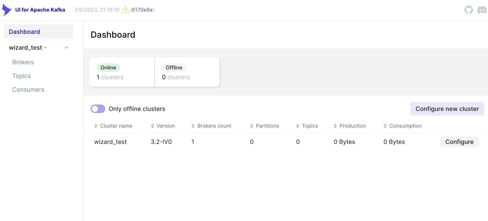

# Configuration wizard

## Dynamic application configuration

.png>)

By default, kafka-ui does not allow to change of its configuration in runtime. When the application is started it reads configuration from system env, config files (ex. application.yaml), and JVM arguments (set by `-D`). Once the configuration was read it was treated as immutable and won't be refreshed even if the config source (ex. file) was changed.

Since version 0.6 we added an ability to change cluster configs in runtime. This option is disabled by default and should be implicitly enabled. To enable it, you should set `DYNAMIC_CONFIG_ENABLED` env property to `true` or add `dynamic.config.enabled: true` property to your yaml config file.

Sample docker compose configuration:

```
services:
  kafka-ui:
    container_name: kafka-ui
    image: provectuslabs/kafka-ui:latest
    ports:
      - 8080:8080
    depends_on:
      - kafka0
    environment:
      DYNAMIC_CONFIG_ENABLED: 'true'
      KAFKA_CLUSTERS_0_NAME: wizard_test
      KAFKA_CLUSTERS_0_BOOTSTRAPSERVERS: kafka0:29092
      
  ... 
```

You can even omit all vars other than `DYNAMIC_CONFIG_ENABLED` to start the application with empty configs and setup it up after startup.

When the dynamic config feature is enabled you will see additional buttons that will take you to "Wizard" for editing existing cluster configuration or adding new clusters:

&#x20;

#### Dynamic config files

Kafka-ui is a stateless application by its nature, so, when you edit configuration during runtime, it will store configuration additions on the container's filesystem (in `dynamic_config.yaml` file). Dynamic config file will be overridden on each configuration submission.

During the configuration process, you can also upload configuration-related files (like truststore and keystores). They will be stored in `etc/kafkaui/uploads` a folder with a unique timestamp suffix to prevent name collision. In the wizard, you can also use files that were mounted to the container's filesystem, without uploading them directly.

**Note**, that if the container is recreated, your edited (and uploaded) files won't be present and the app will be started with static configuration only. If you want to be able to keep the configuration created by wizard, you have to mount/copy the same files into newly created kafka-ui containers (whole `/etc/kafkaui/` folder, by default).

Properties, specified where dynamic config files will be persisted:

| Env variable name            | Yaml property                | Default                            | Description                              |
| ---------------------------- | ---------------------------- | ---------------------------------- | ---------------------------------------- |
| `DYNAMIC_CONFIG_PATH`        | `dynamic.config.path`        | `/etc/kafkaui/dynamic_config.yaml` | Path to dynamic config file              |
| `CONFIG_RELATED_UPLOADS_DIR` | `config.related.uploads.dir` | `/etc/kafkaui/uploads`             | Path where uploaded files will be placed |

#### Implementation notes:

Currently, the new configuration submission leads to a full application restart. So, if your kafka-ui app is starting slow (not a usual case, but may happen when you have a slow connection to kafka clusters) you may notice UI inaccessibility during restart time.
